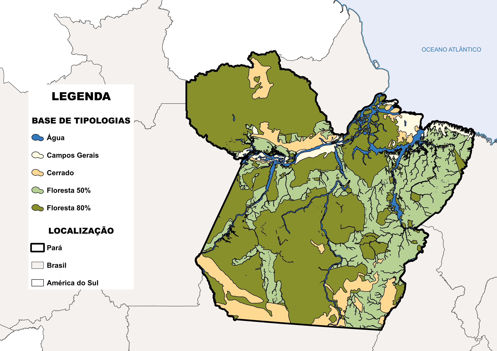
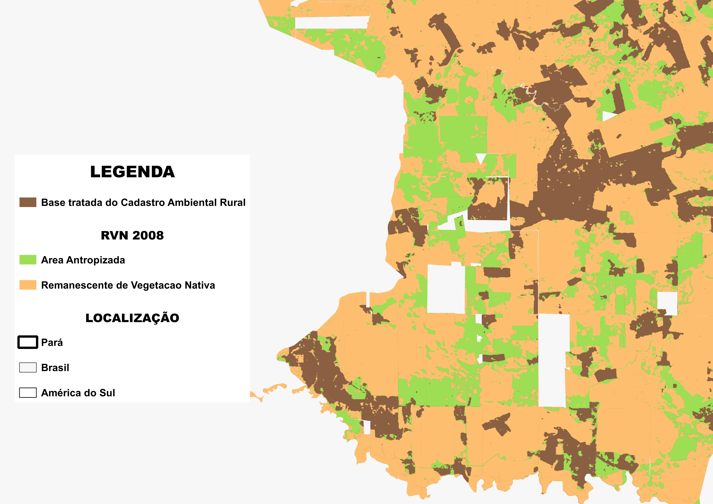
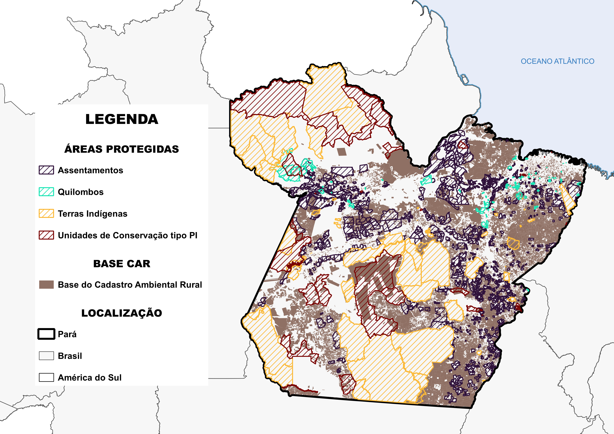
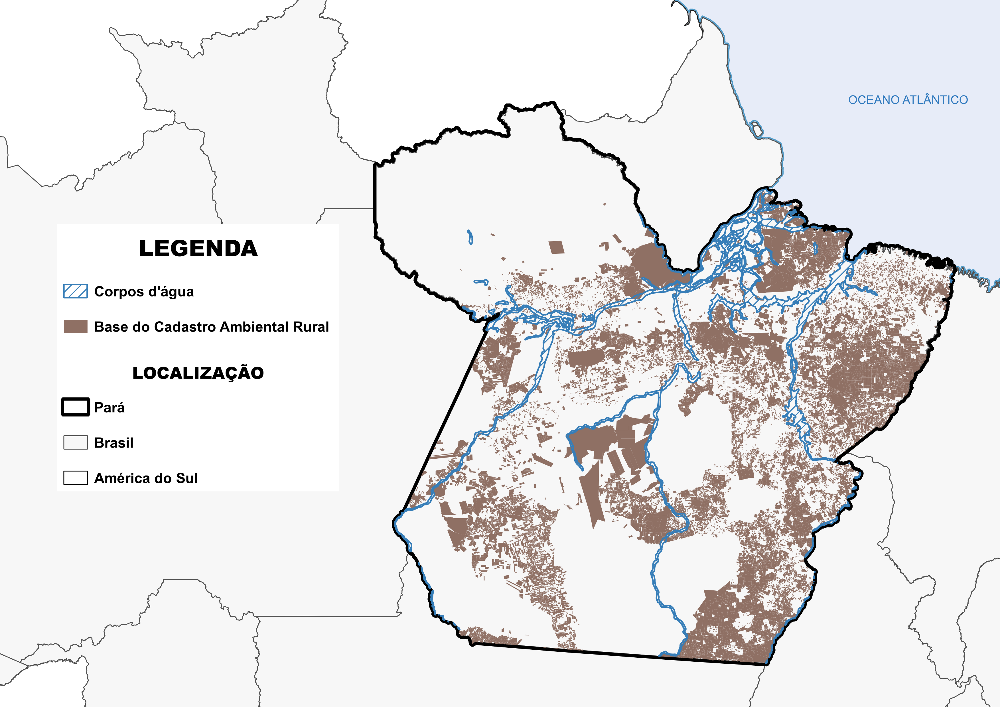
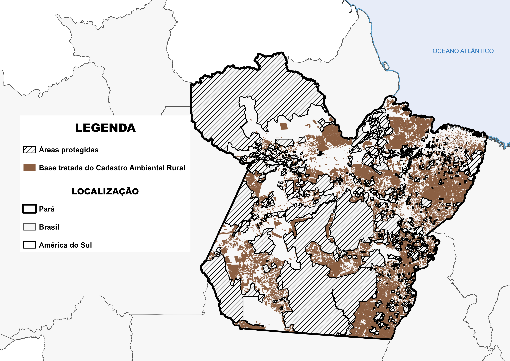
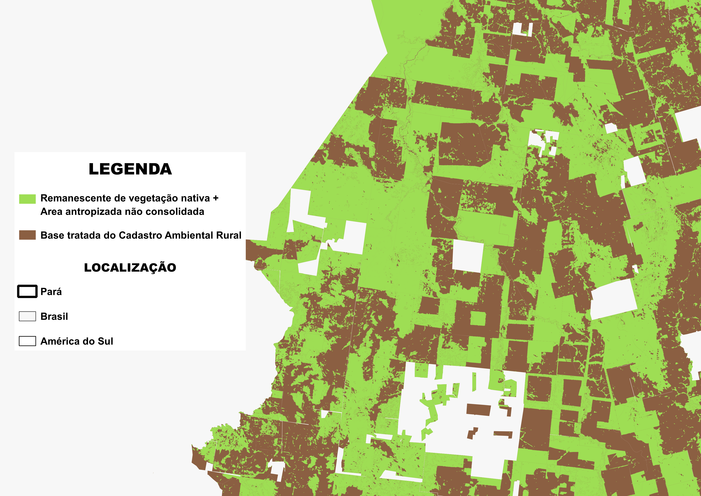

# METODOLOGIA PARA CÁLCULO DO PASSIVO DE RESERVA LEGAL NO ESTADO DO PARÁ

## 1. Resumo Executivo

- **Título do Projeto:** Cálculo do Passivo de Reserva Legal no Estado do Pará
- **Autor:** [Samuel da Costa dos Santos](https://github.com/samuel-c-santos)
- **Data:** 03/12/2024
- **Versão:** 1.0

## 📌 Contexto

A presente nota técnica descreve a metodologia utilizada para calcular o passivo de Reserva Legal (RL) no Estado do Pará, com vistas a subsidiar a compensação ambiental e a regularização ambiental. O conceito de RL está previsto no art. 12 da Lei nº 12.651/2012, conhecida como Código Florestal, que determina os percentuais mínimos de área que devem ser mantidos com vegetação nativa em propriedades privadas, variando conforme a localização e a tipologia do bioma. Para a Amazônia Legal, a legislação estabelece que a RL deve corresponder a 80% da área da propriedade em regiões de floresta, 35% em regiões de cerrado e 20% em regiões de campos gerais (BRASIL, 2012). Entretanto, esse percentual pode ser reduzido para 50% em áreas de expansão e consolidação definidas pelo Macrozoneamento Ecológico-Econômico (MZEE), conforme estabelece o Decreto Federal nº 7.830/2012 (BRASIL, 2012a).

A metodologia adotada para a estimativa do passivo de RL seguiu quatro etapas principais: (i) construção de uma base de tipologias vegetais, (ii) identificação das áreas de vegetação nativa remanescente em 2008, (iii) processamento da base de Cadastro Ambiental Rural (CAR) e (iv) cruzamento das bases e cálculo do passivo.

## 📊 Metodologia

### 🏞️ Etapa 1: Construção da Base de Tipologias Vegetais

A primeira etapa do estudo consistiu na elaboração de uma base de cálculo para a RL mínima, considerando a tipologia vegetal e o MZEE. Para isso, utilizou-se a base "Cobertura Vegetal Nativa", disponível no Sistema Nacional de Informações sobre Recursos Hídricos (SNIRH) (ANA, 2023). A partir dessa base, foram extraídos os dados referentes ao Estado do Pará, que foram classificados conforme segue:

- **Floresta:**
  - Floresta Estacional Decidual
  - Floresta Ombrófila Aberta
  - Floresta Ombrófila Densa
- **Cerrado:**
  - Savana
  - Áreas de Tensão Ecológica
- **Campos Gerais:**
  - Áreas das Formações Pioneiras
- **Água:**
  - Massa d'água

Com base nas exigências legais, cada tipologia foi associada a um percentual mínimo de RL, conforme demonstrado na Tabela 1.
Tabela 1 - Percentual mínimo de Reserva Legal por tipologia

  <table>
    <thead>
      <tr>
        <th style="text-align: center;">Tipologia</th>
        <th style="text-align: center;">Reserva Mínima (%)</th>
      </tr>
    </thead>
    <tbody>
      <tr>
        <td style="text-align: center;">Floresta 80%</td>
        <td style="text-align: center;">80</td>
      </tr>
      <tr>
        <td style="text-align: center;">Floresta 50%</td>
        <td style="text-align: center;">50</td>
      </tr>
      <tr>
        <td style="text-align: center;">Cerrado</td>
        <td style="text-align: center;">35</td>
      </tr>
      <tr>
        <td style="text-align: center;">Campos Gerais</td>
        <td style="text-align: center;">20</td>
      </tr>
    </tbody>
  </table>

A base final gerada foi armazenada no esquema 'visoes' do banco de dados, sob o nome 'tipologia_mzee_final'. A distribuição espacial das tipologias vegetais no Estado do Pará pode ser observada na Figura 1, onde são representadas as categorias de cobertura do solo utilizadas na definição das áreas mínimas de Reserva Legal.

Figura 2: interação entre a base do Cadastro Ambiental Rural (CAR) e as áreas protegidas.

### 🌿 Etapa 2: Identificação do Remanescente de Vegetação Nativa em 2008

Para esta etapa, utilizou-se a base de dados MapBiomas da Gerência de Tratamento Digital de Imagens e Suporte ao Monitoramento Espacial Ambiental - GTDI, que é uma adaptação do projeto MapBiomas - Coleção 9, incorporando uma classificação própria baseada nas classes do SICAR. Essa base permite a comparação da cobertura do solo entre os anos de 2008 e o período atual, permitindo a distinção entre áreas antropizadas não consolidadas, antropizadas não consolidadas, regeneração e remanescentes de vegetação nativa (GTDI, 2023). A união dessas categorias representou a cobertura natural remanescente em 22 de julho de 2008, data de referência estabelecida pelo Código Florestal para fins de regularização ambiental.

Figura 2: identificação do Remanescente de Vegetação Nativa para 2008.

### 📍 Etapa 3: Processamento da Base do Cadastro Ambiental Rural (CAR)

Foram aplicados filtros na tabela dashboard.vw_dw_sicar_v03geo do banco de dados do SICAR, selecionando exclusivamente Imóveis Rurais (IRU) e excluindo registros de Povos e Comunidades Tradicionais (PCT) e Assentamentos (AST). Além disso, foram desconsiderados os cadastros com status "Cancelado", mantendo-se apenas aqueles classificados como "Ativos", "Pendentes" ou "Suspensos". A base de imóveis foi então cruzada com a base de tipologias, eliminando áreas sobre grandes corpos d'água. Paralelamente, foi realizada a sobreposição com a base de áreas protegidas, abrangendo Assentamentos, Unidades de Conservação de tipo PI, Terras Indígenas e Quilombos. Por fim, foram removidos os pseudo-assentamentos, correspondentes a cadastros do tipo IRU que representam polígonos de projetos de assentamento.  

A interação entre a base do Cadastro Ambiental Rural (CAR) e as áreas protegidas, como Assentamentos, Unidades de Conservação, Terras Indígenas e Quilombos, é ilustrada na Figura 2. Após o processamento para eliminar sobreposições com grandes corpos d’água e áreas protegidas, o resultado é apresentado na Figura 3.

Figura 3: interação entre a base do Cadastro Ambiental Rural (CAR) e as áreas protegidas.

Figura 4: sobreposição entre a base do Cadastro Ambiental Rural (CAR) e corpos d'água.

Figura 5: base do Cadastro Ambiental Rural tratada, sem sobreposição com corpos d'água e áreas protegidas.

O banco de dados do SICAR já contém um valor pré-determinado de reserva mínima exigida por lei para cada imóvel, o qual foi utilizado previamente para calcular o excedente ou o passivo de RL. No entanto, devido à alta sobreposição entre imóveis cadastrados, a soma direta dessas áreas resultava em um cálculo impreciso, pois a mesma região era contabilizada múltiplas vezes. Para evitar essa distorção e obter um valor confiável em nível estadual ou regional — em vez de individual por imóvel — foi necessário dissolver a base, separar geometrias multipartes em polígonos simples e atribuir um ID único para cada área, garantindo a correta distribuição espacial e um cálculo preciso do déficit de RL.

### 📐 Etapa 4: Cruzamento das Bases e Cálculo do Passivo de RL

O cruzamento espacial entre a base de CAR e a base de tipologias resultou na geração de uma tabela com IDs únicos e suas respectivas tipologias. A partir desse cruzamento, calculou-se a área de cada polígono e o percentual de RL mínimo, resultando em uma base espacial com classificação tipológica e seus respectivos percentuais exigidos. Em seguida, executou-se a interseção da base de remanescentes de vegetação nativa com a base resultante, dissolvendo por ID único e comparando as áreas de remanescente de vegetação nativa com os valores mínimos exigidos, permitindo assim a quantificação precisa do passivo de Reserva Legal. A Figura 4 ilustra essa sobreposição, destacando a relação entre as áreas de vegetação nativa remanescente e os imóveis rurais cadastrados no SICAR.

Figura 5: sobreposição da base do Cadastro Ambiental Rural tratada e os remanescentes de vegetação nativa em 2008, utilizada para o cálculo do passivo de Reserva Legal.

Figura 6: sobreposição da base do Cadastro Ambiental Rural tratada e os remanescentes de vegetação nativa em 2008, utilizada para o cálculo do passivo de Reserva Legal.

### 📐 Resultados alcançados

A estimativa do passivo de Reserva Legal (RL) no Estado do Pará, considerando os critérios estabelecidos na metodologia, apontou um total de 5,8 milhões de hectares em imóveis que não atendem ao percentual mínimo de RL exigido pela legislação. Nesses casos, a soma da vegetação nativa remanescente e das áreas antropizadas não consolidadas não foi suficiente para atingir o limite legal, indicando a necessidade de compensação ambiental.  

A tabela a seguir apresenta a distribuição do passivo de RL por Região de Integração, detalhando tanto a área estimada quanto o número de imóveis incidentes nessas áreas e que apresentam déficit.

  <table>
    <thead>
      <tr>
        <th style="text-align: center;">Região de Integração</th>
        <th style="text-align: center;">Área de Passivo Estimada (ha)</th>
        <th style="text-align: center;">Nº de Imóveis</th>
      </tr>
    </thead>
    <tbody>
      <tr>
        <td style="text-align: center;">Araguaia</td>
        <td style="text-align: center;">-394.103,00</td>
        <td style="text-align: center;">1.716</td>
      </tr>
      <tr>
        <td style="text-align: center;">Baixo Amazonas</td>
        <td style="text-align: center;">-1.142.893,84</td>
        <td style="text-align: center;">2.240</td>
      </tr>
      <tr>
        <td style="text-align: center;">Carajás</td>
        <td style="text-align: center;">-44.583,95</td>
        <td style="text-align: center;">290</td>
      </tr>
      <tr>
        <td style="text-align: center;">Guajará</td>
        <td style="text-align: center;">-10.529,14</td>
        <td style="text-align: center;">145</td>
      </tr>
      <tr>
        <td style="text-align: center;">Guamá</td>
        <td style="text-align: center;">-18.923,37</td>
        <td style="text-align: center;">142</td>
      </tr>
      <tr>
        <td style="text-align: center;">Lago de Tucuruí</td>
        <td style="text-align: center;">-80.667,88</td>
        <td style="text-align: center;">674</td>
      </tr>
      <tr>
        <td style="text-align: center;">Marajó</td>
        <td style="text-align: center;">-1.639.590,66</td>
        <td style="text-align: center;">2.104</td>
      </tr>
      <tr>
        <td style="text-align: center;">Rio Caeté</td>
        <td style="text-align: center;">-50.865,01</td>
        <td style="text-align: center;">247</td>
      </tr>
      <tr>
        <td style="text-align: center;">Rio Capim</td>
        <td style="text-align: center;">-549.675,20</td>
        <td style="text-align: center;">1.584</td>
      </tr>
      <tr>
        <td style="text-align: center;">Tapajós</td>
        <td style="text-align: center;">-945.603,55</td>
        <td style="text-align: center;">2.354</td>
      </tr>
      <tr>
        <td style="text-align: center;">Tocantins</td>
        <td style="text-align: center;">-279.703,34</td>
        <td style="text-align: center;">692</td>
      </tr>
      <tr>
        <td style="text-align: center;">Xingu</td>
        <td style="text-align: center;">-669.559,88</td>
        <td style="text-align: center;">2.572</td>
      </tr>
      <tr>
        <th style="text-align: center;">Total Geral</th>
        <th style="text-align: center;">-5.826.698,80</th>
        <th style="text-align: center;">14.760</th>
      </tr>
    </tbody>
  </table>

Os maiores passivos de RL foram identificados nas Regiões de Integração do Baixo Amazonas e Marajó, que juntas somam 2,78 milhões de hectares, representando 47,7% do total estadual. Esse padrão reflete a predominância de grandes imóveis rurais nessas regiões, onde o balanço entre a soma do Remanescente de Vegetação Nativa (RVN) e das Áreas Antropizadas Não Consolidadas (AA) em relação à exigência mínima de RL resulta em déficit.  

Os valores apresentados fornecem um panorama detalhado do passivo ambiental no estado e permitem subsidiar políticas públicas voltadas para a compensação e recomposição florestal. No entanto, é importante considerar que os cálculos foram realizados sobre imóveis dissolvidos geometricamente, evitando sobreposições e distorções nos valores de passivo. Dessa forma, os números apresentados devem ser considerados como estimativas gerais e não como valores individuais definitivos. Essa e outras limitações da metodologia adotada e possíveis impactos nos resultados, que serão discutidos no próximo tópico.

## ⚠️ Fragilidades da Metodologia

Embora o cálculo do passivo de Reserva Legal seja preciso em relação à área estimada, sua efetividade pode ser limitada devido à situação cadastral dos imóveis. Um número significativo de registros encontra-se com status Suspenso ou Pendente, o que implica que os polígonos dessas propriedades podem sofrer alterações futuras. Dessa forma, os valores calculados representam um potencial de passivo ambiental por localização, mas não necessariamente um valor exato baseado na configuração definitiva dos imóveis.  

Outra fragilidade está relacionada à base de dados utilizada para caracterização da vegetação nativa. Como existem diferentes fontes de informação com metodologias variadas, os resultados do cálculo podem apresentar variações dependendo da base adotada. Neste estudo, utilizou-se a base Cobertura Vegetal Nativa do SNIRH/ANA, mas há intenção de replicar a metodologia com outras bases para fins de comparação. Para isso, já foi pré-processada a base de vegetação do IBGE.  

Além disso, a desatualização do Macrozoneamento Ecológico-Econômico (MZEE) representa uma limitação, uma vez que a versão oficial da base não é atualizada desde 2016. Para mitigar esse problema, optou-se pelo uso de uma versão beta do MZEE, ainda não lançada oficialmente.  

Apesar dessas fragilidades, acredita-se que, na escala de análise adotada, tais variações não comprometem significativamente os resultados obtidos.

## 📌 Requisitos para Execução

Para a execução da metodologia, são necessários os seguintes requisitos técnicos:

- Banco de Dados: PostgreSQL com a extensão PostGIS para armazenamento e processamento dos dados espaciais.  
- Linguagem de Programação: Python 3.8 ou superior, com as bibliotecas geopandas, rasterio, shapely, pandas e psycopg2 instaladas.  
- SIG: QGIS versão 3.34.3, utilizado para visualização, análise e validação das camadas espaciais.

Certifique-se de que todas as dependências estão instaladas corretamente para garantir a execução fluida dos procedimentos de análise.  

## 📄 Referências

ANA – AGÊNCIA NACIONAL DE ÁGUAS E SANEAMENTO BÁSICO. **Cobertura Vegetal Nativa. 2023**. Disponível em: https://metadados.snirh.gov.br/geonetwork/srv/api/records/d6f207dc-4298-4ff2-9c1e-1cb9f343cd9e. Acesso em: 30 jan. 2025.

BRASIL. Lei nº 12.651, de 25 de maio de 2012. **Dispõe sobre a proteção da vegetação nativa**. Disponível em: http://www.planalto.gov.br/ccivil_03/_ato2011-2014/2012/lei/l12651.htm. Acesso em: 30 jan. 2025.

GTDI – GERÊNCIA DE TRATAMENTO DIGITAL DE IMAGENS E SUPORTE AO MONITORAMENTO ESPACIAL AMBIENTAL. **Classificação de Uso e Cobertura do Solo - Iniciativa MapBiomas**. Disponível em: https://www.semas.pa.gov.br/analisecar/geoprocessamento.php. Acesso em: 30 jan. 2025.

---

